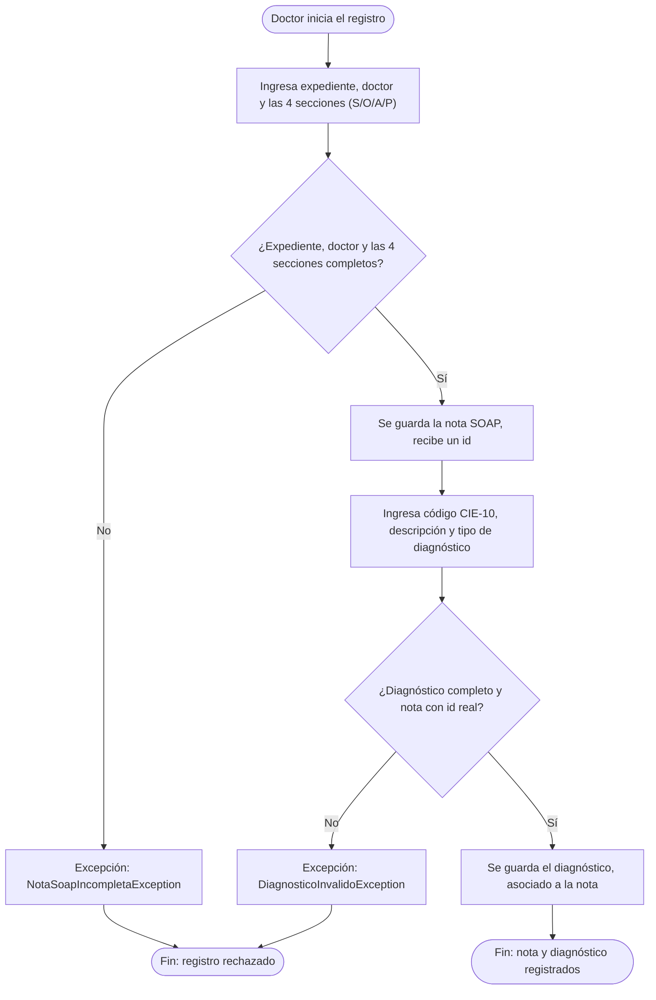
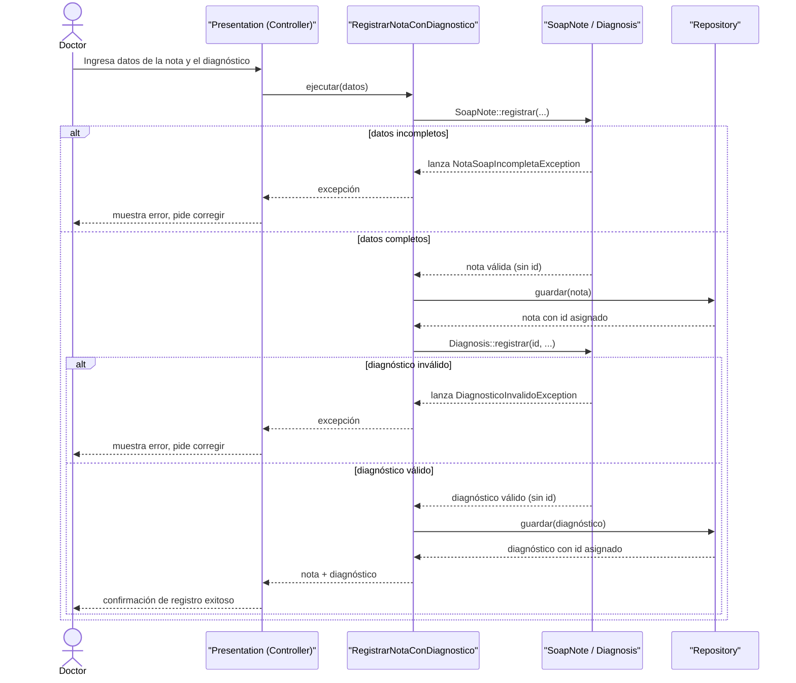

# Semana 1 — Diagramas de actividad y secuencia

Completa el entregable de la semana 1 (el texto de actores, alcance y casos de uso ya existía; faltaban estos dos diagramas). Módulo: Notas SOAP y diagnósticos. Estudiante: Joshua Eduardo García Reyes, carné 22-5831.

## Diagrama de actividad — registro de nota SOAP y asociación de diagnóstico clínico

Incluye las decisiones, las excepciones, y el resultado final, tal como pide la consigna.

## Diagrama de secuencia — mismo flujo

Participantes, mensajes, validaciones, y respuesta. Corresponde exactamente al recorrido real del código (`RegistrarNotaSoapController` → `RegistrarNotaConDiagnostico` → `SoapNote`/`Diagnosis` → repositorio), no es un diagrama aparte inventado.

## Trazabilidad con los casos de uso

Los dos diagramas cubren el mismo y único caso de uso ya descrito en el texto de actores y alcance ("registrar nota SOAP y asociar diagnóstico clínico"), con el mismo actor (Doctor), las mismas dos excepciones de negocio ya implementadas en el código (`NotaSoapIncompletaException`, `DiagnosticoInvalidoException`), y el mismo resultado esperado. No se inventó ningún camino nuevo: ambos diagramas describen exactamente lo que el código de `RegistrarNotaConDiagnostico` ya hace.
