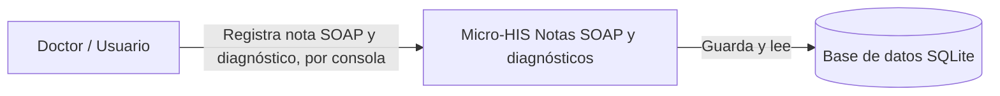
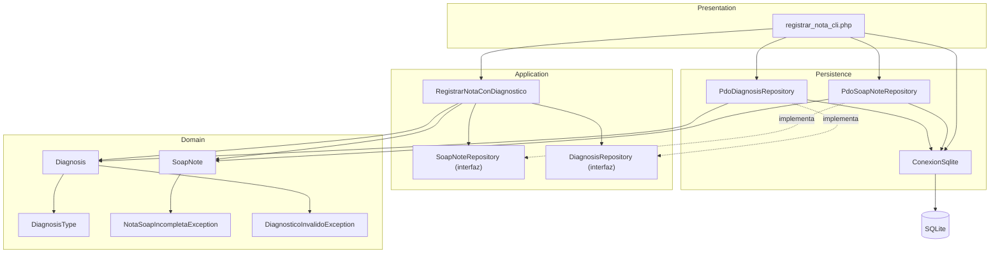

# Vista arquitectónica — Micro-HIS Notas SOAP y diagnósticos

Semana 3, Análisis de Sistemas II. Módulo: Notas SOAP y diagnósticos. Estudiante: Joshua Eduardo García Reyes, carné 22-5831.

## 1. Contexto

El Micro-HIS es un programa aparte, en PHP puro (sin framework), que ejecuta un solo flujo: un doctor registra una nota SOAP y le asocia un diagnóstico clínico. No depende de ningún otro sistema ni servicio externo, solo de su propia base de datos.

## 2. Componentes y sus dependencias

El módulo está separado en cuatro capas: Presentation, Application, Domain y Persistence. La regla que se siguió para armarlas fue: cada capa solo puede depender de las capas "más adentro" que ella, nunca al revés.

## 3. Qué hace cada capa

**Domain.** Las reglas del negocio puras: `SoapNote` no se deja crear sin sus cuatro secciones, expediente y doctor; `Diagnosis` no se deja crear sin código CIE-10, descripción, ni sin estar ligado a una nota con id real. No conoce PHP de bases de datos ni de consola, solo reglas.

**Application.** El caso de uso `RegistrarNotaConDiagnostico` coordina el flujo completo: le pide a Domain que valide la nota, le pide al repositorio que la guarde, y recién con el id real arma el diagnóstico. Esta capa define dos interfaces (`SoapNoteRepository` y `DiagnosisRepository`) pero no sabe cómo se implementan; por eso no depende de PDO ni de SQLite.

**Persistence.** Acá es donde vive PDO de verdad. `PdoSoapNoteRepository` y `PdoDiagnosisRepository` implementan las interfaces de Application usando sentencias preparadas, y `ConexionSqlite` abre la conexión y crea las tablas la primera vez que se usa.

**Presentation.** `registrar_nota_cli.php` es el único punto que conoce a todas las demás capas: arma la conexión, arma los repositorios, arma el caso de uso, le pasa lo que el usuario escribió en la consola, y muestra el resultado o el error.

## 4. Dependencias externas

- PHP 8.2 o superior (se usan enums, propiedades `readonly` y promoción de propiedades en el constructor).
- Extensión `pdo_sqlite` de PHP, sin ningún paquete de Composer ni framework.
- Base de datos: un solo archivo SQLite (`storage/database.sqlite`), sin servidor aparte.
