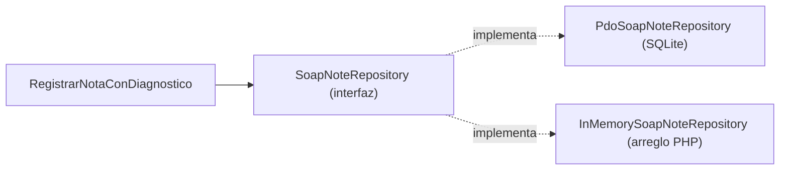
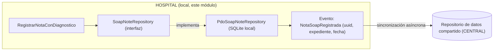

# Patrón Repository — Micro-HIS Notas SOAP y diagnósticos

Semana 4, Análisis de Sistemas II. Módulo: Notas SOAP y diagnósticos. Estudiante: Joshua Eduardo García Reyes, carné 22-5831.

## Qué agrega esta semana

En la semana 3 ya habían quedado definidas las interfaces `SoapNoteRepository` y `DiagnosisRepository`, dentro de Application, junto con su primera implementación real: `PdoSoapNoteRepository` y `PdoDiagnosisRepository`, que guardan en SQLite.

Esta semana se agrega una segunda implementación de esas mismas interfaces, `InMemorySoapNoteRepository` e `InMemoryDiagnosisRepository`, que guardan en un arreglo de PHP en vez de en una base de datos. El punto no es que haga falta guardar en memoria en producción, sino demostrar lo que de verdad da el patrón Repository: el caso de uso `RegistrarNotaConDiagnostico` no sabe ni le importa cuál de las dos implementaciones está usando.

## Por qué importa

Sin esta separación, para probar el flujo completo habría que tener sí o sí una base de datos corriendo. Con la interfaz de por medio, `tests/RepositoryPatternTest.php` prueba el mismo caso de uso usando los repositorios en memoria, sin tocar SQLite para nada, y sin cambiar ni una línea de `RegistrarNotaConDiagnostico`. Esa es la prueba de que la capa Application quedó de verdad desacoplada de cómo se guardan los datos.

## Evidencia

- `src/Persistence/InMemorySoapNoteRepository.php` y `src/Persistence/InMemoryDiagnosisRepository.php`: la segunda implementación de las interfaces.
- `tests/RepositoryPatternTest.php`: 4 casos, todos en verde, usando exclusivamente los adaptadores en memoria.

## Integración con un repositorio de datos compartido

Este módulo vive del lado HOSPITAL, siguiendo la misma regla que ya establece la actividad integradora del curso: nunca una llave foránea directa contra CENTRAL, solo un identificador lógico o eventos de sincronización.

El repositorio local (`PdoSoapNoteRepository`) sigue siendo la fuente de verdad para este hospital: las notas se guardan ahí primero, siempre, sin depender de que CENTRAL esté disponible en ese momento. Después de guardar, se dispararía un evento (`NotaSoapRegistrada`) con un identificador lógico propio (un UUID, no el id autoincremental de SQLite, porque ese número se repite entre hospitales distintos). Un proceso aparte, de sincronización, sería el único que le habla a CENTRAL, empujando ese evento cuando haya conexión.

La razón por la que esto no obliga a tocar nada de lo ya construido es justamente el patrón Repository: agregar esa sincronización sería una tercera implementación de la misma interfaz `SoapNoteRepository` (por ejemplo, un decorador que envuelve a `PdoSoapNoteRepository` y además publica el evento), sin que `RegistrarNotaConDiagnostico` ni `SoapNote` se enteren de que ahora existe un repositorio compartido del otro lado.
