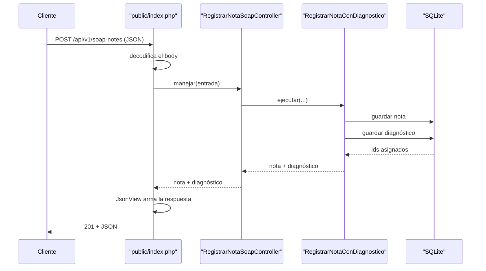
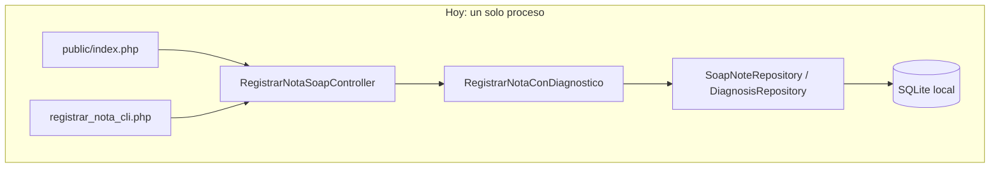

# Semana 5 — Diseño cliente-servidor y contrato API

Módulo: Notas SOAP y diagnósticos. Estudiante: Joshua Eduardo García Reyes, carné 22-5831.

Esta semana el Micro-HIS evoluciona de un flujo por consola a uno cliente-servidor. No se dividió el sistema en microservicios todavía: la evidencia de esta semana es el contrato, el análisis de la frontera candidata, y un prototipo chico que demuestra que el contrato es real, no solo teoría. La justificación de por qué NO se divide el sistema ahora está en la sección 6.

## 1. Contrato de API

**`POST /api/v1/soap-notes`** — registra una nota SOAP y le asocia un diagnóstico, en una sola operación (el mismo flujo que ya hacía la CLI).

Cuerpo de la petición (JSON):

```json
{
  "medical_record_id": "EXP-900",
  "doctor_id": "DOC-20",
  "subjective": "Cefalea pulsátil",
  "objective": "TA 120/80, afebril",
  "assessment": "Migraña probable",
  "plan": "Analgésico y reposo",
  "diagnosis": {
    "cie10_code": "G43.9",
    "description": "Migraña sin aura",
    "type": "principal"
  }
}
```

Respuesta `201 Created`:

```json
{
  "soap_note": { "id": 1, "medical_record_id": "EXP-900", "doctor_id": "DOC-20", "subjective": "...", "objective": "...", "assessment": "...", "plan": "...", "recorded_at": "2026-09-17T01:37:59+00:00" },
  "diagnosis": { "id": 1, "soap_note_id": 1, "cie10_code": "G43.9", "description": "...", "type": "principal" }
}
```

Catálogo de errores (probados de verdad contra el servidor):

| HTTP | code | Cuándo pasa |
|---|---|---|
| 400 | `cuerpo_invalido` | El JSON no trae los campos mínimos o falta el objeto `diagnosis` |
| 400 | `tipo_invalido` | `diagnosis.type` no es uno de los cuatro valores válidos |
| 404 | `ruta_no_encontrada` | Cualquier ruta o método distinto a `POST /api/v1/soap-notes` |
| 422 | `nota_incompleta` | Falta expediente, doctor, o alguna de las 4 secciones (regla de Domain) |
| 422 | `diagnostico_invalido` | Falta código CIE-10, descripción, o el id de la nota (regla de Domain) |
| 500 | `error_persistencia` | La base de datos rechazó el guardado |

## 2. Diagrama de secuencia



El punto central: el `Router` es el único código nuevo. `Controller` y `UseCase` son exactamente los mismos objetos que ya usaba la CLI de la semana 4, sin cambiarles una línea.

## 3. Frontera de microservicio evaluada



La frontera candidata a microservicio es exactamente el límite que ya existe entre `Application` y `Persistence`, marcado por las interfaces `SoapNoteRepository`/`DiagnosisRepository`. Ese límite ya está probado: es el mismo que permitió cambiar de PDO a InMemory sin tocar nada más (semana 4). Si algún día hiciera falta separar esto en un servicio aparte, el contrato HTTP de la sección 1 sería exactamente la interfaz pública de ese servicio.

## 4. Propiedad de datos

Este servicio es dueño exclusivo de sus notas SOAP y diagnósticos. Ningún otro componente escribe directo en `soap_notes` ni `diagnoses`; todo pasa por este contrato. Sigue la misma regla ya establecida en la semana 4 para CENTRAL: nunca una llave foránea directa de afuera hacia esta base, solo el id que este servicio decide entregar en la respuesta.

## 5. Comunicación

Síncrona, petición-respuesta (REST sobre HTTP), porque quien registra una nota necesita saber de inmediato si quedó guardada o si hubo un error de negocio, para poder corregirlo ahí mismo. Para la sincronización hacia un repositorio compartido (CENTRAL, semana 4), la comunicación seguiría siendo asíncrona por eventos, no por este mismo contrato: son necesidades distintas.

## 6. Seguridad

El prototipo de hoy no incluye autenticación, a propósito, para no construir infraestructura de producción sin que haga falta todavía. Lo que sí queda documentado como requisito antes de un despliegue real: el `doctor_id` no debería venir del cliente sin verificar, tendría que salir de un token (por ejemplo Bearer/JWT) validado en el servidor; todo el tráfico debería ir sobre HTTPS; y ningún dato clínico debería viajar en la URL (por eso todo va en el cuerpo del POST, nunca en query params).

## 7. Resiliencia

Cada error de negocio devuelve un código HTTP y un `code` estable (tabla de la sección 1), para que un cliente pueda reintentar solo cuando corresponde (por ejemplo, un 500 sí se reintenta, un 422 no, porque reintentar el mismo dato inválido nunca va a funcionar). Queda identificado un límite real y todavía sin resolver: si el cliente reintenta un 201 que en realidad sí se guardó (por ejemplo porque la respuesta se perdió en la red), hoy se crearía una nota duplicada. La solución de libro es una clave de idempotencia (`Idempotency-Key` en el header), que quedaría pendiente para una siguiente iteración.

## 8. Observabilidad

Todavía no implementado, pero especificado: cada petición debería loguearse con un id de correlación propio, el `medical_record_id`, el resultado (código HTTP y `code` del error si lo hay), y el tiempo de respuesta. Eso alcanzaría para responder, sin adivinar, cuántas notas se registran por día y cuál es el error más común.

## 9. Consistencia

Local: la nota y su diagnóstico se guardan con dos `INSERT` separados, uno detrás del otro, sin una transacción que los una todavía. Esto es una brecha real, no resuelta hoy: si el segundo `INSERT` (el del diagnóstico) fallara justo después de que el primero ya tuvo éxito, quedaría una nota sin diagnóstico. La solución propuesta, para una próxima semana, es envolver ambos guardados en una transacción de base de datos, expuesta a Application a través de una interfaz propia (algo como una `UnitOfWork`), para no romper la regla de que Application nunca conoce PDO directamente.

Hacia CENTRAL (repositorio compartido, semana 4): consistencia eventual, vía el evento de sincronización, no transaccional.

## 10. Migración razonada

1. **Hoy**: un solo proceso PHP, dos puntas de entrada (CLI y HTTP), mismo Controller y misma base SQLite.
2. **Si hiciera falta separar** (por ejemplo, si otro equipo necesita consumir este módulo sin depender de que el resto del sistema esté levantado): se extraería `Presentation`, `Application`, `Domain` y `Persistence` a su propio proceso desplegable, exponiendo el mismo contrato de la sección 1. El límite ya existe en el código (las interfaces de repositorio), así que la extracción sería mover carpetas, no reescribir lógica.
3. **Justificación medible que haría falta antes de dar ese paso**: que el volumen de peticiones de este módulo, o su necesidad de escalar aparte, esté afectando de forma medible al resto del sistema. Sin ese dato, dividir ahora sería complejidad sin beneficio, que es justo lo que la consigna de esta semana pide evitar.

## 11. Plan de issue, rama, worktree y PR

- **Issue**: "Semana 5: contrato API para registro de nota SOAP y diagnóstico", con la tabla de errores de la sección 1 como criterio de aceptación.
- **Rama**: `feature/week-05-api-contrato`, creada desde `feature/week-04-patron-repository` (mismo criterio que la semana 4: esta semana evoluciona el mismo Micro-HIS, no arranca de cero).
- **Worktree**: mismo worktree ya en uso (`C:\Users\reyes\Desktop\notas-soap-diagnosticos-asii11-`), sin necesitar una carpeta nueva.
- **Pull Request**: hacia `developer`, en Draft, incluyendo este documento, el router (`public/index.php`), y la vista `JsonView.php`.

## 12. Evidencia del prototipo

Los cuatro casos de la tabla de errores se probaron contra un servidor real (`php -S`, sin ninguna infraestructura adicional): camino feliz (201), regla de dominio (422), ruta inexistente (404), y tipo de diagnóstico inválido (400). Los cuatro respondieron exactamente como especifica el contrato.
