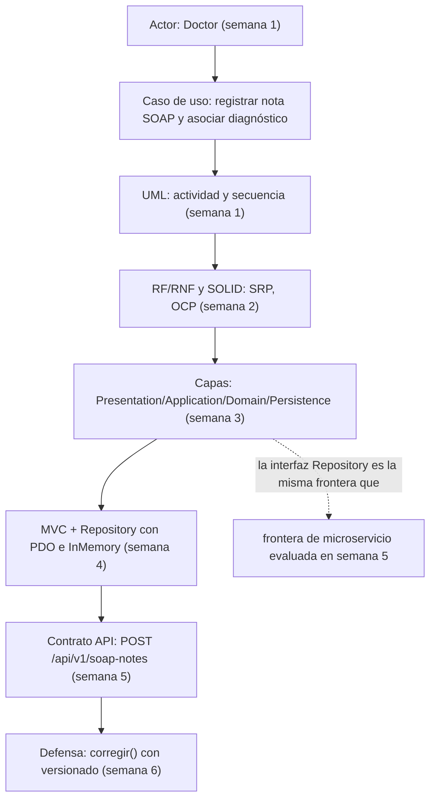

# Semana 6 — Primera evaluación parcial: defensa de la arquitectura

Módulo: Notas SOAP y diagnósticos. Estudiante: Joshua Eduardo García Reyes, carné 22-5831.

## 1. Diagrama trazable

Conecta actores, UML, RF/RNF, SOLID, capas, Repository y contrato API: todo gira alrededor del mismo caso de uso, "registrar nota SOAP y asociar diagnóstico clínico", desde la semana 1 hasta la 5.

Cada flecha es una dependencia real de diseño, no solo de calendario: por ejemplo, el contrato API de la semana 5 no inventa un flujo nuevo, expone exactamente el mismo caso de uso que ya estaba modelado desde la semana 1 y probado desde la semana 3.

## 2. Matriz decisión → evidencia

| Decisión | Semana | Evidencia |
|---|---|---|
| Un solo actor (Doctor), un caso de uso central | 1 | `docs/semana-01-diagramas-actividad-secuencia.md`, PR #1 |
| SRP: separar entidad, regla de validación y persistencia | 2 | Documento de semana 2, PR #2 |
| Domain sin dependencias externas | 3 | `src/Domain/SoapNote.php`, `src/Domain/Diagnosis.php`, cero imports de PDO |
| Patrón Repository como frontera Application/Persistence | 3–4 | `src/Application/SoapNoteRepository.php` (interfaz), `src/Persistence/PdoSoapNoteRepository.php` e `InMemorySoapNoteRepository.php` (dos implementaciones intercambiables) |
| MVC: controlador sin SQL ni reglas de negocio | 4 | `src/Presentation/Controllers/RegistrarNotaSoapController.php`, `tests/ControllerTest.php` |
| Repository también habilita probar sin base de datos real | 4 | `tests/RepositoryPatternTest.php` (4 casos, cero SQL) |
| HTTP como una segunda Presentation, sin duplicar lógica | 5 | `public/index.php` reutiliza el mismo `RegistrarNotaSoapController` que la CLI |
| No dividir en microservicios sin justificación medible | 5 | `docs/semana-05-contrato-api.md`, sección 10 (migración razonada) |
| Corrección de notas sin perder historial (versionado) | 6 | `SoapNote::corregir()`, `tests/VersionadoTest.php` (11 casos) |
| Autoría clínica: cada versión conserva quién la redactó | 6 | `tests/VersionadoTest.php`, casos de `doctor_id` distinto entre versiones |

## 3. Registro del cambio práctico defendido

**La pregunta**: ¿qué pasa si un doctor necesita corregir una nota SOAP ya guardada, sin perder el historial clínico ni la autoría original?

**Por qué la arquitectura ya tenía respuesta para esto**: la regla de negocio central del módulo, desde el primer documento del curso, siempre dijo que las correcciones no deben borrar la versión anterior, deben crear una nueva versión ligada a la anterior por id. El límite entre Domain y Persistence (patrón Repository) hizo que agregar esto fuera un cambio contenido: una sola entidad (`SoapNote`) ganó un método nuevo (`corregir()`), sin tocar Application, Presentation, ni ninguna de las dos implementaciones de Persistence salvo para sumar una columna.

**Las cinco cosas que pedía la consigna, una por una**:

- **Notas SOAP**: `corregir()` valida las cuatro secciones igual que `registrar()`, así que una corrección nunca puede quedar incompleta.
- **Diagnósticos**: hoy `Diagnosis` no tiene su propio `corregir()`. Decisión consciente, no olvido: un diagnóstico queda asociado al id de una nota específica; si se corrige la nota, la versión nueva de la nota puede recibir un diagnóstico nuevo asociado a ELLA, sin que haga falta versionar el diagnóstico por separado. Si más adelante hiciera falta corregir un diagnóstico sin tocar la nota, se agregaría siguiendo exactamente el mismo patrón.
- **Autoría clínica**: `corregir()` recibe el id del doctor que corrige, distinto al autor original si hace falta. La versión anterior conserva su autor tal cual quedó escrita.
- **Versionado**: cada corrección es una fila nueva en la base (`previous_version_id` apunta a la anterior), nunca un `UPDATE` que borre lo que había.
- **Expediente**: `medical_record_id` se mantiene igual entre todas las versiones de una misma nota, porque todas pertenecen al mismo expediente.

**Evidencia verificable**: `tests/VersionadoTest.php`, 11 casos, corridos contra una base SQLite real (no un doble): confirma que corregir sin id lanza excepción, que la versión original queda intacta en la base, que la nueva versión queda ligada por `previous_version_id`, y que el autor de cada versión se preserva por separado.
