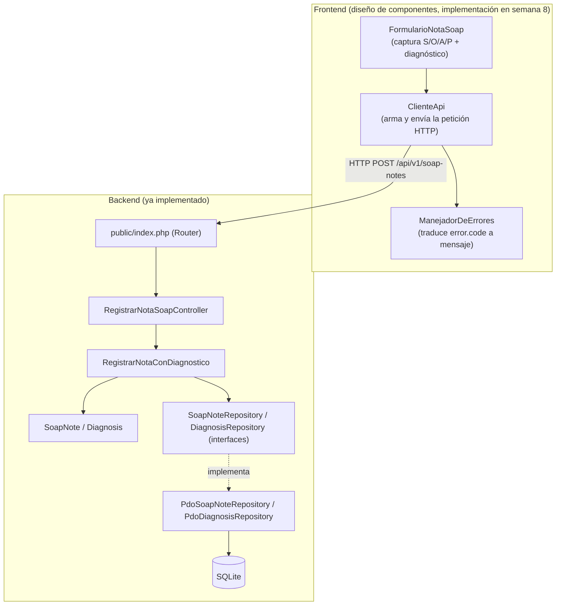

# Semana 7 — Diseño de componentes y refactorización

Módulo: Notas SOAP y diagnósticos. Estudiante: Joshua Eduardo García Reyes, carné 22-5831.

## 1. Diagrama de componentes (backend y frontend)

El frontend todavía no existe como código (la semana 8 define su UX en detalle); acá se diseña a nivel de componente, para que el contrato de comunicación con el backend quede claro desde ya.



## 2. Contratos de entrada/salida

**Frontend → Backend**: el mismo contrato ya especificado en la semana 5 (`docs/semana-05-contrato-api.md`), sin cambios. `FormularioNotaSoap` arma exactamente ese cuerpo JSON; `ClienteApi` no le agrega ni le saca nada.

**Backend → Frontend (respuesta)**: `201` con `soap_note` y `diagnosis` (para mostrar la confirmación con los ids asignados), o un objeto `error` con `code` y `message`. `ManejadorDeErrores` mapea cada `code` (`nota_incompleta`, `diagnostico_invalido`, `tipo_invalido`, `error_persistencia`) a un mensaje en español para el usuario, sin que el frontend tenga que interpretar texto libre.

## 3. Punto de mayor acoplamiento, identificado

El método `RegistrarNotaConDiagnostico::ejecutar()` recibía **9 parámetros sueltos**: seis de la nota (`medicalRecordId`, `doctorId`, `subjective`, `objective`, `assessment`, `plan`) y tres del diagnóstico (`cie10Code`, `diagnosisDescription`, `diagnosisType`), todos mezclados en una sola lista posicional.

Eso es acoplamiento real, no solo un método largo: cualquier cambio en la forma de una nota (agregar un campo, por ejemplo) obliga a tocar la firma completa, y con eso a todo el que la llama, aunque ese cambio no tenga nada que ver con el diagnóstico. Los dos conceptos (nota y diagnóstico) quedaban atados por la forma del método, no por una relación real de negocio.

## 4. Refactor concreto: antes y después

**Antes** (`ejecutar()` con 9 parámetros posicionales):

```php
public function ejecutar(
    string $medicalRecordId,
    string $doctorId,
    string $subjective,
    string $objective,
    string $assessment,
    string $plan,
    string $cie10Code,
    string $diagnosisDescription,
    DiagnosisType $diagnosisType,
): array
```

**Después** (dos objetos de solicitud, cada uno dueño de su propia forma):

```php
public function ejecutar(SolicitudNotaSoap $nota, SolicitudDiagnostico $diagnostico): array
```

`SolicitudNotaSoap` agrupa los seis campos de la nota; `SolicitudDiagnostico` agrupa los tres del diagnóstico. Cada uno puede crecer (agregar un campo nuevo a la nota, por ejemplo) sin tocar al otro ni cambiar la firma del método que los recibe.

**Por qué esto no amplía el módulo**: no se agregó ningún comportamiento nuevo, ningún caso de uso nuevo. Las mismas nueve piezas de información viajan igual que antes, solo que agrupadas según a qué concepto de negocio pertenecen. El comportamiento observable (qué se guarda, qué reglas se validan, qué errores se lanzan) es idéntico antes y después: las 35 pruebas existentes pasan sin que se les haya cambiado la intención, solo la forma de armar la llamada.

**Costo del refactor**: 7 archivos tocados (`RegistrarNotaConDiagnostico.php`, `RegistrarNotaSoapController.php`, y 5 archivos de prueba), 2 archivos nuevos (los DTOs), 0 archivos de Domain o Persistence modificados. El acoplamiento estaba contenido en una sola capa (Application) y en quien la llama (Presentation y los tests), justo como se espera si las capas están bien separadas.
