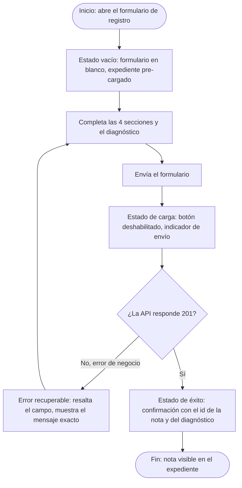
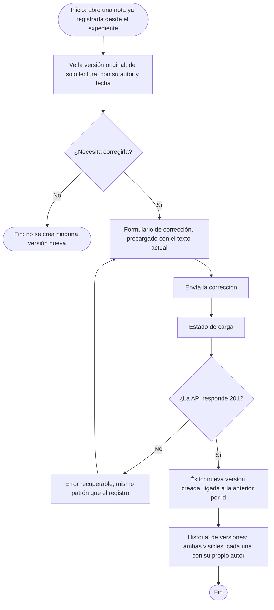

# Semana 8 — Diseño de experiencia de usuario

Módulo: Notas SOAP y diagnósticos. Estudiante: Joshua Eduardo García Reyes, carné 22-5831.

## 0. Roles autorizados, aclarados antes de diseñar el flujo

Desde la semana 1 el único actor identificado era "Doctor". Esta semana pide diseñar "por roles" en plural, y la semana 6 ya había introducido, en el código, una distinción real de permisos: quien registra una nota no es necesariamente quien la corrige (`corregir()` recibe el id de un doctor distinto al autor original, pensando en un supervisor). En vez de inventar roles sin base, este documento formaliza esa misma distinción como dos roles:

- **Médico tratante**: registra la nota original y su diagnóstico.
- **Médico revisor**: puede corregir una nota ya existente (por ejemplo, un supervisor o especialista), sin borrar la versión anterior.

## 1. User flow — Médico tratante (registrar)

## 2. User flow — Médico revisor (corregir)

## 3. Ayuda contextual

En el formulario, cada una de las 4 secciones (S/O/A/P) lleva un texto breve de ayuda debajo del campo, no en una ventana aparte, para no interrumpir el registro (ejemplo: bajo "Subjetivo", el texto "Lo que el paciente cuenta, en sus propias palabras"). El campo de diagnóstico incluye un enlace corto a la tabla de tipos válidos (`principal`, `secundario`, `presuntivo`, `definitivo`), visible antes de que el usuario cometa el error, no después.

## 4. Protección de datos vinculados

- **Notas SOAP y diagnósticos**: solo se muestran completos dentro del expediente correspondiente, nunca en una lista general sin abrir el expediente primero.
- **Autoría clínica**: el nombre del doctor autor de cada versión es visible siempre (es dato clínico legítimo, no sensible de ocultar), pero el formulario de corrección no permite editarlo manualmente: lo completa el sistema según la sesión activa, para que nadie pueda atribuirse una corrección ajena.
- **Versionado**: el historial de versiones es de solo lectura; ninguna pantalla ofrece "eliminar" una versión anterior, ni siquiera al médico revisor.
- **Expediente**: el número de expediente se muestra pre-cargado y no editable en el formulario, para que un error de tipeo nunca asocie una nota al paciente equivocado.

Los wireframes de la sección 5 muestran estas reglas aplicadas, no solo enunciadas.

## 5. Wireframes (6, anotados)

Viven en `docs/wireframes/`, como SVG (se abren directo en el navegador o en GitHub, sin depender de ninguna herramienta de diseño).

1. **`01-registro-vacio.svg`** — Médico tratante, estado vacío inicial. Expediente y autor precargados, ayuda contextual bajo cada sección.
2. **`02-error-recuperable.svg`** — error recuperable: falta la sección Subjetivo. El resto del formulario no se pierde.
3. **`03-estado-carga.svg`** — formulario bloqueado mientras se envía, botón deshabilitado.
4. **`04-estado-exito.svg`** — confirmación con los dos ids (nota y diagnóstico), salida hacia "ver expediente completo".
5. **`05-correccion-revisor.svg`** — Médico revisor: versión original de solo lectura arriba, formulario de corrección abajo, aviso explícito de que se crea una versión nueva.
6. **`06-historial-versiones.svg`** — el expediente mostrando ambas versiones ligadas, cada una con su propio autor, ninguna con opción de borrado.
