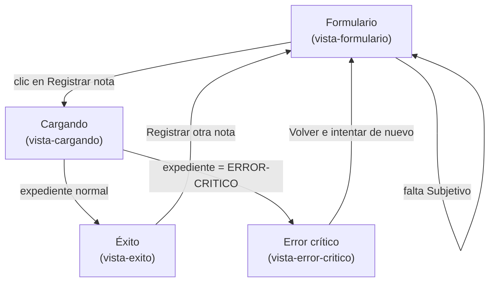

# Semana 11 — Prototipo navegable, desktop y móvil

Módulo: Notas SOAP y diagnósticos (ASII-11). Estudiante: Joshua Eduardo García Reyes, carné 22-5831.

## 1. El prototipo

`prototipo/index.html`. Un solo archivo, sin dependencias externas, sin backend real: HTML + CSS + JavaScript. Se abre directo en cualquier navegador (doble clic) y es de verdad navegable, no son imágenes estáticas.

Cubre el mismo formulario de las semanas 8 y 10 (rol Médico tratante, cuatro secciones SOAP, diagnóstico), y dos desenlaces:

- **Camino feliz**: completar el formulario con cualquier expediente normal y enviar, muestra la confirmación con los ids.
- **Error crítico**: escribir `ERROR-CRITICO` en el campo de expediente y enviar, simula que la base de datos no respondió (`error_persistencia`), sin perder el texto ya escrito.

Es responsive de verdad (la misma página, sin una versión aparte): a partir de 431px de ancho el formulario usa el espacio disponible como en desktop; por debajo, se acomoda a una sola columna igual que los wireframes de la semana 10.

Accesibilidad ya incluida en el prototipo, no solo en el diseño: cada campo tiene su `<label>`, el foco por teclado tiene un contorno visible, y el error se anuncia en una región `aria-live="assertive"` para que un lector de pantalla lo lea solo.

## 2. Mapa de navegación

La validación de campo vacío (por ejemplo, sin Subjetivo) no cambia de vista: el aviso aparece en la misma pantalla del formulario, igual que en los wireframes de las semanas 8 y 10.

## 3. Capturas

En `capturas/`, generadas de verdad ejecutando el prototipo con un navegador real (Playwright + Chromium), no dibujadas a mano:

- `desktop-camino-feliz.png` (1280px de ancho)
- `desktop-error-critico.png` (1280px de ancho)
- `mobile-camino-feliz.png` (390px de ancho)
- `mobile-error-critico.png` (390px de ancho)

## 4. Consistencia con las semanas anteriores

Mismos colores, mismo rol (Médico tratante), mismo mensaje de error (`nota_incompleta`/`error_persistencia`, igual que el contrato de la semana 5), mismo patrón de botón fijo abajo en mobile (semana 10). Nada de esto se inventó de nuevo para el prototipo, es la misma decisión de diseño llevada a algo que se puede tocar.

## Cómo probarlo

Abrí `prototipo/index.html` directo en cualquier navegador, sin necesitar ningún servidor. Completá el formulario y probá los dos casos: un expediente cualquiera (camino feliz), y `ERROR-CRITICO` como expediente (error crítico).
